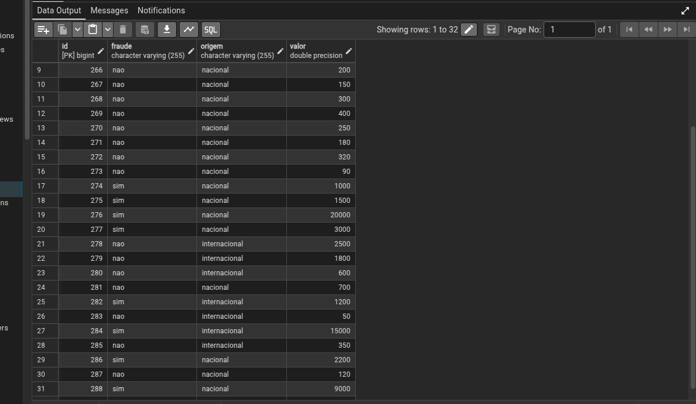
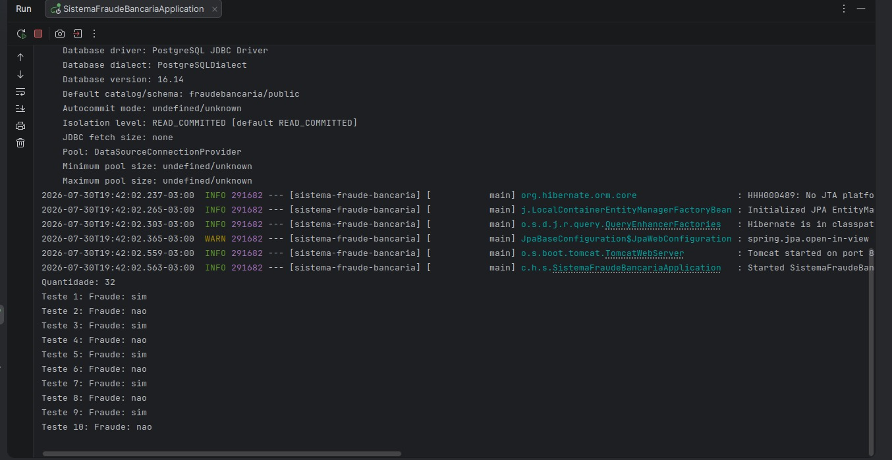

# 🔍 Sistema de Detecção de Fraude Bancária — Machine Learning com Spring Boot + PostgreSQL

- Java 22
- Spring Boot
- Spring Data JPA / Hibernate
- PostgreSQL
- Weka 3.8.6
- Algoritmo J48 (Árvore de Decisão)
- Maven

## 📋 Sobre o Projeto

O sistema treina um modelo de Machine Learning com dados históricos de transações bancárias, persistidos em um banco PostgreSQL, e classifica novas transações como **fraude** ou **não fraude** com base nos padrões aprendidos.

### Funcionalidades

- Persistência de dados de treino em banco PostgreSQL via Spring Data JPA
- Treinamento de modelo com dados reais consultados do banco (não mais fixos no código)
- Classificação de novas transações em tempo real
- Arquitetura com responsabilidade única: lógica de ML isolada da camada de persistência e da camada Spring Boot

## 📁 Estrutura do Projeto

src/main/java/com/haveneryck/sistemafraudebancaria/
├── SistemaFraudeBancariaApplication.java # Classe principal (Spring Boot)
├── DeteccaoDeFraudeBancaria.java # Lógica de Machine Learning (Weka)
├── model/
│ └── Transacao.java # Entity JPA (mapeamento da tabela transacao)
└── repository/
└── TransacaoRepository.java # Interface Spring Data JPA


## 🧠 Como Funciona o Machine Learning

| Etapa | Descrição |
|-------|-----------|
| 1. Coleta de dados | Transações bancárias armazenadas no PostgreSQL, com atributos: valor, origem e classificação (fraude/não fraude) |
| 2. Persistência | Dados de treino gerenciados via Spring Data JPA (Entity `Transacao` + `TransacaoRepository`) |
| 3. Treinamento | Modelo treinado com algoritmo J48 (árvore de decisão) via Weka, usando dados reais consultados do banco |
| 4. Classificação | Novas transações classificadas em tempo real pelo modelo treinado |

## 🧩 Desafio Técnico: Integração ML + Persistência

O projeto inicialmente treinava o modelo com dados fixos, escritos diretamente no código Java. O desafio foi integrar essa lógica de Machine Learning (baseada em objetos `Instances`/`Attribute` do Weka) com uma camada de persistência relacional, sem acoplar as duas responsabilidades.

**Problema**: a classe `DeteccaoDeFraudeBancaria` era instanciada manualmente (`new`), fora do ciclo de vida do Spring — o que impedia a injeção direta de um `Repository`.

**Solução**: a classe foi convertida em um `@Component` gerenciado pelo Spring, recebendo o `TransacaoRepository` via injeção de dependência no construtor. A lógica de carregamento de dados (`adicionarExemplos()`) passou a consultar o banco (`findAll()`) em vez de usar valores fixos, mantendo o restante da lógica de ML intacta.

Essa mudança exigiu reestruturar o ponto de entrada da aplicação (`main`), migrando a orquestração do fluxo de treino/classificação para um `CommandLineRunner`, garantindo que o `Repository` já estivesse disponível no momento da execução.

## 🔐 Segurança de Credenciais

A senha do banco de dados **não é armazenada no código-fonte**. Ela é lida via variável de ambiente:

```properties
spring.datasource.password=${DB_PASSWORD}
```
### Dados persistidos no PostgreSQL



### Execução com dados vindos do banco



## ⚙️ Como Executar

**Pré-requisitos**
- Java 22+
- Maven
- PostgreSQL instalado e rodando localmente

**Passos**

```bash
# Clone o repositório
git clone git@github.com:haveneryck/sistema-fraude-bancaria.git

# Entre na pasta
cd sistema-fraude-bancaria

# Crie um banco de dados chamado "fraudebancaria" no PostgreSQL

# Defina a variável de ambiente com a senha do seu banco
export DB_PASSWORD=sua_senha_aqui

# Execute o projeto
./mvnw spring-boot:run
```

Ao subir, o Spring Boot cria automaticamente a tabela `transacao` (via `ddl-auto=update`) e popula com dados de exemplo definidos em `src/main/resources/data.sql`.

## 📈 Exemplo de Classificação

Transação: valor=50000.00, origem=internacional
Resultado: Fraude: sim

Transação: valor=150.00, origem=nacional
Resultado: Fraude: não


## 🏗️ Decisões de Arquitetura

- **Responsabilidade única**: a classe `DeteccaoDeFraudeBancaria` encapsula toda a lógica de ML, separada da camada de persistência (`model`/`repository`) e da inicialização Spring Boot
- **Spring Data JPA**: escolhido por já ser o padrão adotado em outros projetos do portfólio, garantindo consistência de stack
- **Weka 3.8.6**: biblioteca consolidada para Machine Learning em Java, com suporte nativo ao algoritmo J48
- **J48**: implementação do algoritmo C4.5, ideal para classificação binária com dados tabulares
- **Variável de ambiente para credenciais**: evita exposição de senha no repositório público, seguindo boas práticas de segurança

## 👨‍💻 Autor

**Vinícius Oliveira Brito**
[LinkedIn](https://linkedin.com/in/haveneryck) • [GitHub](https://github.com/haveneryck)
